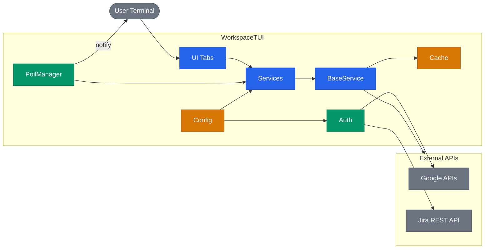
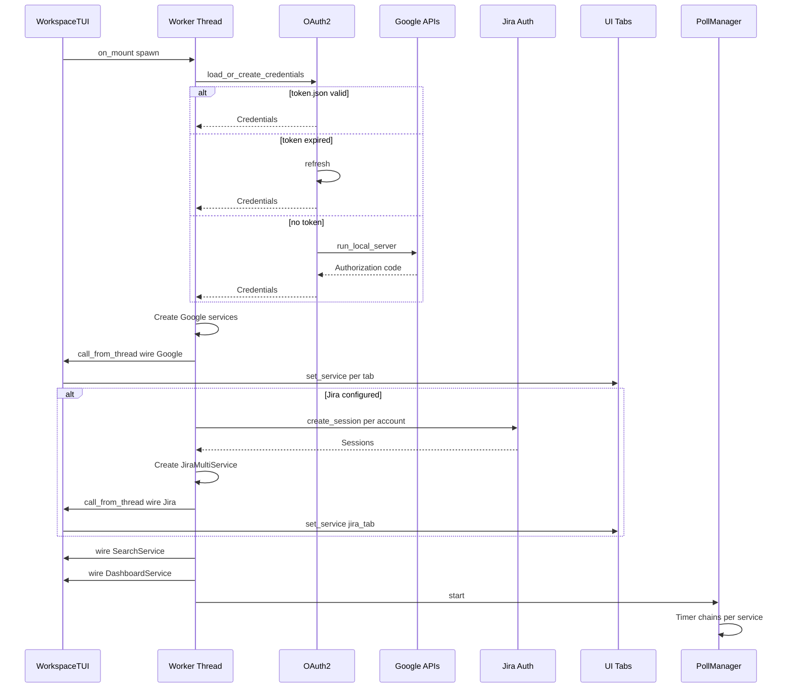
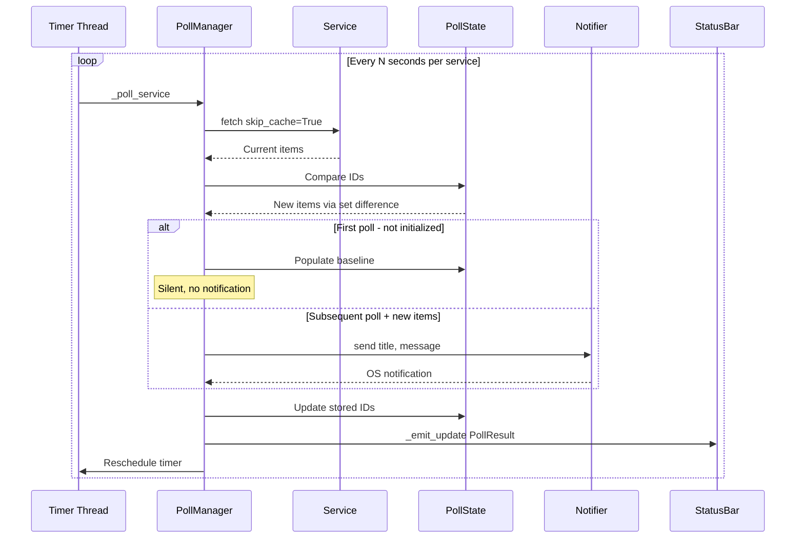
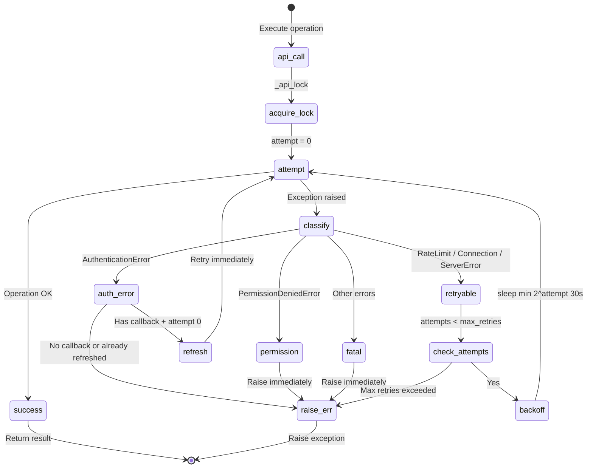
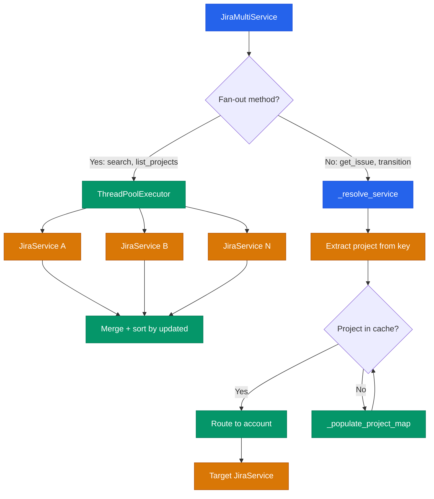

# Architecture

Technical diagrams for Workspace TUI internals. For a high-level overview, see the main [README](../README.md#architecture).

## System Overview

**Layers:** Tabs (UI) -> Services (business logic) -> BaseService (retry/cache/error) -> External APIs.

Services never import UI. Tabs receive services via `set_service()`. Config flows inward through pydantic-settings.

## Service Initialization

On `on_mount`, the app spawns a worker thread that authenticates with Google (and optionally Jira), creates service instances, and wires them into tabs via `call_from_thread`. Search and Dashboard services are wired progressively as backends come online.

Key details:
- OAuth2 token is saved with `chmod 0o600` and auto-refreshed on expiry
- Jira is optional: if not configured, Jira tab shows a placeholder, dashboard adapts
- `_start_polling()` runs last, regardless of individual service failures

## Polling and State-Diffing

`PollManager` runs independent timer chains per service. Each poll fetches fresh data (bypassing cache), diffs against stored state using set difference on IDs, and notifies only on genuinely new items. The first poll after startup populates the baseline silently.

Default intervals: Gmail 60s, Chat 30s, Calendar 300s, Jira 120s (all configurable, minimum 10s).

State-diffing per service:
- **Gmail**: `current_ids - stored_unread_ids` = new unread messages
- **Chat**: last message name per space, compared against stored value
- **Calendar**: 15-minute lookahead window, notified IDs tracked in a pruned set
- **Jira**: `current_keys - stored_known_keys` = newly assigned issues

## BaseService Retry

Every API call goes through `_retry()`, which acquires a per-service lock, classifies errors, and applies exponential backoff for retryable failures.

Error classification (`_categorize_error`):
- Google `HttpError` with `.resp["status"]` -> status-based mapping
- `requests.HTTPError` with `.response.status_code` -> status-based mapping
- String heuristics ("connection", "timeout") -> `ConnectionFailedError`
- Fallback -> generic `ServiceError`

Backoff schedule: 1s, 2s, 4s (capped at 30s), max 3 attempts.

## Jira Multi-Account Routing

`JiraMultiService` wraps N `JiraService` instances. Methods that aggregate data fan out to all accounts in parallel via `ThreadPoolExecutor`. Methods that target a specific issue route to the correct account by extracting the project key and looking it up in a lazily-populated cache.

Fan-out methods: `search_issues`, `list_projects`, `get_worklogs_since`, `search_users`.

Delegating methods: `get_issue`, `transition_issue`, `add_worklog`, `add_comment`, `create_issue`, `update_issue`.

Config: `JIRA_ACCOUNTS=acme,widgets` + `JIRA_{NAME}_BASE_URL` + `JIRA_{NAME}_DEFAULT_PROJECT` per account (name uppercased).
